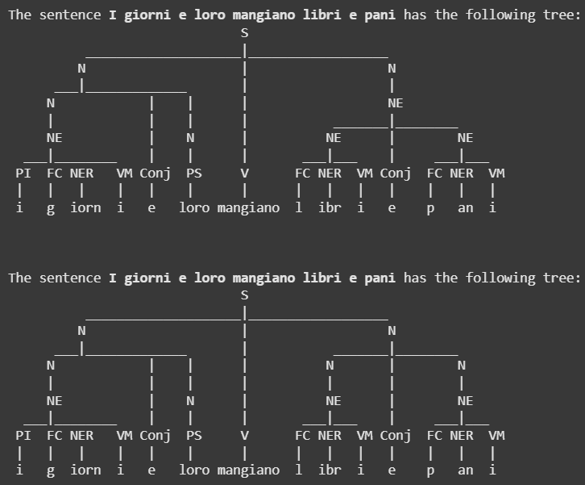
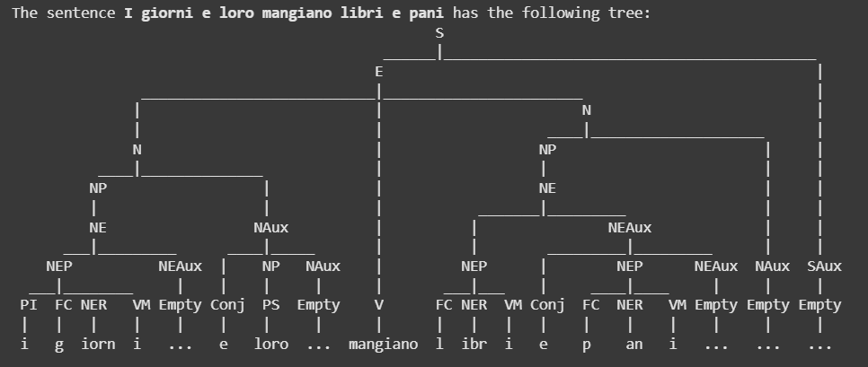
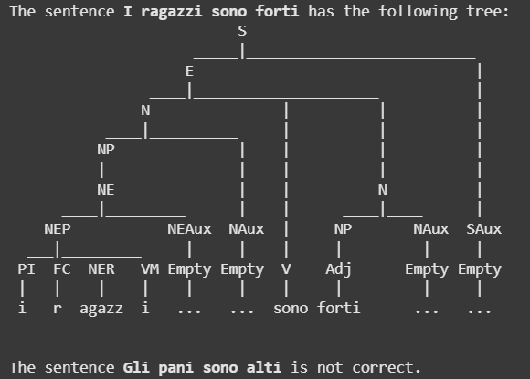

# ItalianGrammar

# Description
The language used is italian. A Romance language of the Indo-European language family. It is the official language of Italy, San Marino, Switzerland and the Vatican City. It's structure is similar to the othher Romance languages, such as french, spanish, tc.

## Language Structure
The basic structure of an affirmation consists of Subject, verb and predicate. Although it seems similar to many other languages, italian has a lot of conjugations, in which a sentence may be structured in a way the pronoun, noun and verb follows the same pattern, every compound (pronoun, noun and verb) must match in gender and quantity (singular or plural). An example of this may be the phrase "The girl runs." -> "La ragazza corre." if we want to change it a bit to "The girls run" it would say "Le ragazze corrono."

## Plural
For this project I decided to use the plural form. Ignoring the irregular verbs, the general rules are:
* For femenine sentences "Le" is the adequate pronoun
* For masculine sentences, you must use the pronoun "I" if the noun starts with a consonant, and "Gli" if it starts with a vowel
* If nouns end with an "e", it means it is femenine, if it ends with an "i", it means it is masculine
* Adverbs have no gender

Because we want to focus on the correct use of pronouns, we are only going to use unisex adjectives. This is not meant to make sense, just to verufy that the sentence has a proper structure.

# Models
The model used is going to validate the plural forms, checking that the used pronouns are correct. The words used in this project are:

## Pronouns + Nouns
* `i libri`: books
* `i ragazzi`: boys
* `i giorni`: days
* `gli amici`: friends
* `i pani`: breads
* `le case`: house
* `le donne`: ladys
* `le scuole`: schools
* `le insalate`: salads
* `le cose`: things

## Verbs
* `sono`: are
* `mangiano`: eat
* `legono`: read

## Adverbs
* `molto`: very / much
* `qui`: here
* `sempre`: always

## Adjectives
* `forti`: strong
* `alti`: tall
* `belli`: beautiful

## Conjunctions
* `e`: and
* `o`: or

# Grammar
A Programming Language Grammar is a set of instructions about how to write statements that are valid for that programming language. The instructions are given in the form of rules that specify how characters and words can be put one after the other, to form valid statements (also called sentences). (GitHub Pages, 2019).

To design the grammar for the project we eill be parsing trees LL(1), which means we need to get rid of left recursion and ambiguity.

## Initial Grammar
```
S -> N V N Conj V | N V N | N V | S Conj S
N -> NE | N Conj N | PS | N Adj | Adj 
NE -> NE Conj NE | PI FC NER VM | PF NER VF | PG FV NER VM | FC NER VM | NER VF | FV NER VM
V -> V Adv | V Conj V
Adv -> Adv Conj Adv
Adj -> Adj Conj Adj
NER -> 'ibr' | 'agazz' | 'iorn' | 'mic' | 'an' | 'donn' | 'scuol' | 'insalat' | 'cos' | 'cas'
PS -> 'loro'
PI -> 'i'
PG -> 'gli'
PF -> 'le'
VM -> 'i'
VF -> 'e'
V -> 'sono' | 'mangiano' | 'legono'
Adv -> 'molto' | 'qui' | 'sempre'
Adj -> 'forti' | 'alti' | 'belli'
FC -> 'b' | 'c' | 'd' | 'f' | 'g' | 'h' | 'j' | 'k' | 'l' | 'm' | 'n' | 'p' | 'q' | 'r' | 's' | 't' | 'v' | 'w' | 'x' | 'y' | 'z'
FV -> 'a' | 'e' | 'i' | 'o' | 'u'
Conj -> 'e' | 'o'
```

As this is the initial grammar, we can observe ambiguity and left recursion, which will duplicate some trees, such as the one for the sentence `"I giorni e loro mangiano libri e pani"` (The days and them eat books and breads). This is because when using several nouns, the tree will be able to form in different ways because of the ambiguity and left recursion.




## Eliminate Ambiguity
To eliminate ambiguity we need to use intermediate states on each line which calls itself twice in the same option, for example, in `S -> S Conj S | *other states*` which would be solved with the intermediate state `S -> S Conj E | E` `E -> *other states*`. I also added this states in N (NP) and NE (NEP)

```
S -> S Conj E | E
E -> N V N Conj V | N V N | N V
N -> N Conj NP | NP | N Adj
NP -> NE | PS | Adj
NE -> NE Conj NEP | NEP
NEP -> PI FC NER VM | PF NER VF | PG FV NER VM | FC NER VM | NER VF | FV NER VM
V -> V Conj V | V Adv
Adv -> Adv Conj Adv
Adj -> Adj Conj Adj
```

## Eliminate Left Recursion - Final State
To eliminate left recursion we need to get rid of the "left calls on itself" which means that the lines like `N -> N Conj NP | NP` must be changed using the formula `A -> A a | b` = `A -> b A'` `A' -> a A' | *empty*` giving the result of `N -> NP NAux` `NAux -> Conj NP NAux | *empty*`. We need to repeat as many times as neccesary, in my case, 3 times.
```
S -> E SAux
SAux -> Conj E SAux | Empty
E -> N V N Conj V | N V N | N V
N -> NP NAux
NAux -> Conj NP NAux | Empty
NP -> NE | PS | N Adj | Adj
NE -> NEP NEAux
NEAux -> Conj NEP NEAux | Empty
NEP -> PI FC NER VM | PF NER VF | PG FV NER VM | FC NER VM | NER VF | FV NER VM
V -> V Adv VAux
VAux -> Conj V VAux | Empty
Adv -> Adv Conj Adv
Adj -> Adj Conj Adj
```

This would result in the following tree for the same sentence used in the initial grammar:



## Tests
To test the program I used the following sentences:

`Correct:`
* I giorni e loro mangiano libri e pani
* Le donne mangiano molto insalate
* Gli amici sono alti
* Loro legono i libri
* Le scuole sono qui
* I pani sono molto belli
* Le cose sono molto belli e loro legono i libri
* I ragazzi sono forti

`Incorrect:`
* Gli pani sono alti
* Le scuole gli amici alti
* I giorni sono legono
* Le ragazzi sono belli e forti
* Il giorni e mangiano

This are the results for the correct and incorrect sentences respectively.




# References
* Pietro. (2019b, septiembre 30). What is a programming language grammar? Compilers. https://pgrandinetti.github.io/compilers/page/what-is-a-programming-language-grammar